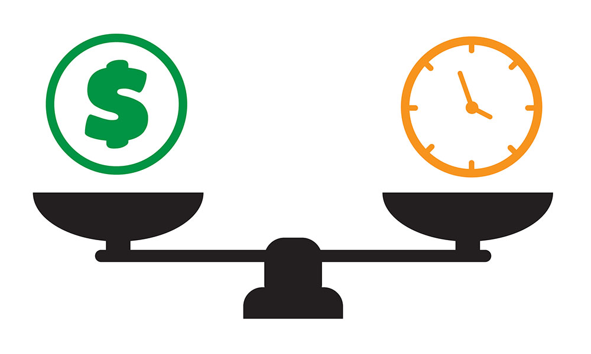

# Smart Pricing

## What is our time worth?

When accepting tasks, everyone has an internal gauge of how much their time is worth. If someone offers to pay $0.05 for one hour of work, this would be immediately declined. If someone offers to pay $5,000 for one hour of work, this would be immediately accepted. 

On extreme ends of the time-value spectrum, is is easy to know if a task is worthwhile. As people moves towards the middle of this spectrum, it becomes less clear is a particular task is worth their time. And this is the problem: most of life is lived in the gray zone of the time-value spectrum.

## Finding the right price

When accepting tasks, providers are used to self-pricing their time. This usually involves asking their peers, performing online searches to see how they measure up, or simply basing it on their current salary. But what they don't know are the prices that similar providers are actually getting booked, and how often they get booked. They also cannot tell how much interest they are generating or if the buyers are willing to pay the price they are asking. This is where the smart pricing comes in, by keeping their prices competitive as demand for them (and providers similar to them) changes.

Smart pricing is an algorithm to price a provider's time deterministically. Machine learning is utilized to develop continuously evolving predictive models based on multiple factors including:

* Work history
* Education
* Skills and endorsements
* Booking history and reputation score
* Trust score

By taking advatage of these predictve pricing models and real-time booking analysis, smart pricing can automatically adjust a provider's price to match market demands.
    
## Personalization and controls

To provide a better and more personalized experience, smart pricing has the following settings that providers can tweak.

* The <strong>minimum price</strong> is the lowest a price will go when demand is low. This means price may drop to attract more booking, but never below the threshold is set.

* The <strong>maximum price</strong> is the highest price it can be booked for, even on high demands, in order to keep the price affordable. This setting is optional but highly encouraged.

* The <strong>disable smart pricing</strong> can be set if providers wishes to use flat pricing, regardless of demand.